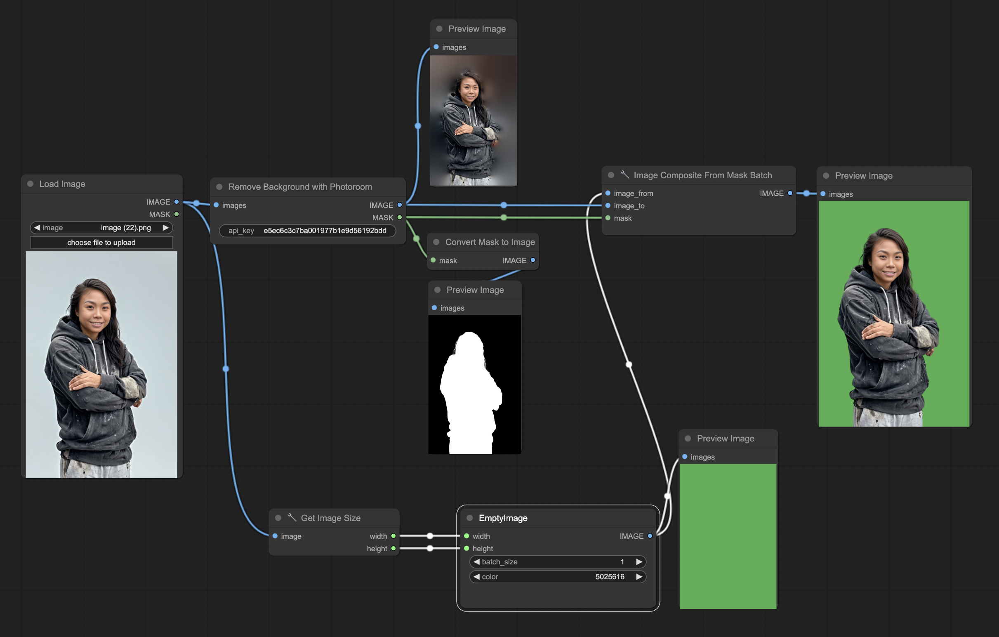

# ComfyUI Discopixel Nodes

A small collection of custom nodes for use with [ComfyUI](https://github.com/comfyanonymous/ComfyUI), by Discopixel.

## 🔌 Available Nodes

#### 1. Remove Background using Photoroom API

Sometimes you just need a higher quality and more automatic background removal than what's available opensource.


[Example Workflow](example_workflow.json)

## ⚙️ Installation

#### 1. Using Comfy Registry

Find us in the ComfyUI registry: https://registry.comfy.org/publishers/discopixel

#### 2. Manual

First, clone the repo into your ComfyUI extensions directory:

```
cd ComfyUI/custom_nodes
git clone https://github.com/discopixel-studio/comfyui-discopixel
```

Then, install the dependencies using your preferred method:

```
pip3 install -r requirements.txt
```

Then restart ComfyUI, and off you go! 🚀
